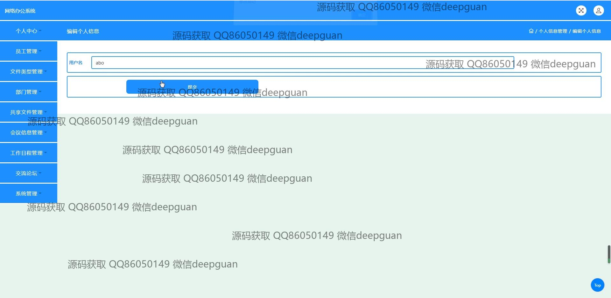
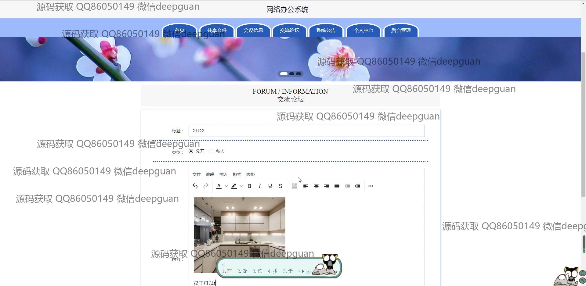

<h1 align="center">网络办公系统+jsp</h1>

## 简介
网络办公系统：角色分为管理员、员工；功能包括个人中心、员工管理、文件管理、部门管理、共享文件管理、会议信息管理、工作日程管理、交流论坛及系统管理，支持多种办公管理操作，提高工作效率。    --计算机毕业设计源码；毕设源码；java毕业设计源码

## 联系方式

<h3 align="center">获取完整代码与数据库文件 + 微信：deepguan QQ: 86050149 QQ群: 783742310</h3>

<h3 align="center">可帮忙远程部署 包运行成功！提供远程部署、修改代码、设计文档指导、代码讲解等服务！</h3>

## 功能介绍（完整见运行截图）
管理员：基本功能包括登录、注册和退出系统。在首页，管理员可以通过主导航栏访问各个模块，如共享文件、会议信息、交流论坛和系统公告管理。管理员还可以通过系统后台进行员工管理、部门管理和文件类型管理等操作。这些功能有助于维护系统的整体运营并支持信息的发布和交流。

员工：员工可以登录系统，访问个人中心进行个人信息的查看和修改。在系统内，员工可以使用共享文件管理模块上传、下载和管理文件，以及参与交流论坛的讨论。员工还可以查看会议信息和工作日程，根据需要上传便利的文件和设定提醒以便于日程管理。员工通过系统拥有发布任务和想法的权限，并能与其他员工进行信息共享和讨论。

用户：用户登录后可以访问系统的个人中心，编辑个人信息如姓名、部门、联系方式等。此外，用户可访问各种模块，如共享文件和交流论坛，发布和查看公告信息。用户还可以管理和参与会议信息、文件类型和工作日程，增强协作能力。系统设计旨在促进内部沟通和协作，提高办公效率和团队互动。

访客：访客无需登录即可查看系统的公共信息，如系统介绍和功能概述。通过主页导航和公共页面，访客可以了解系统提供的各项功能模块的基本介绍。虽然访客无法参与文件管理和内部交流，他们可以通过注册转换为用户以访问更多功能和信息。

## 运行截图

本代码来源于网络,仅供学习参考使用!

